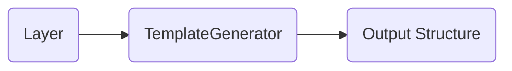
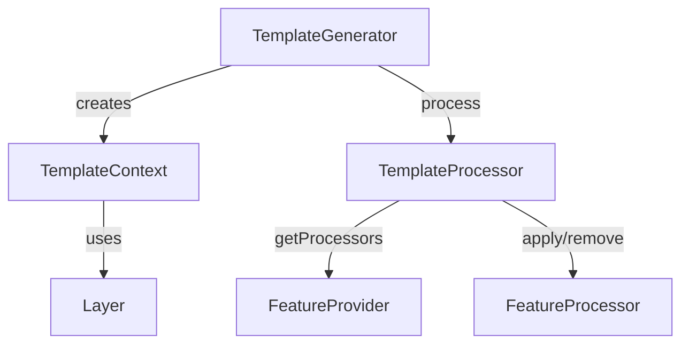
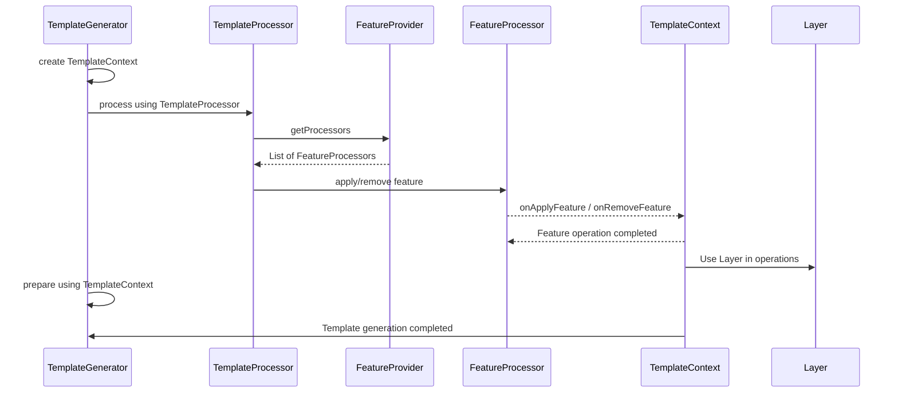
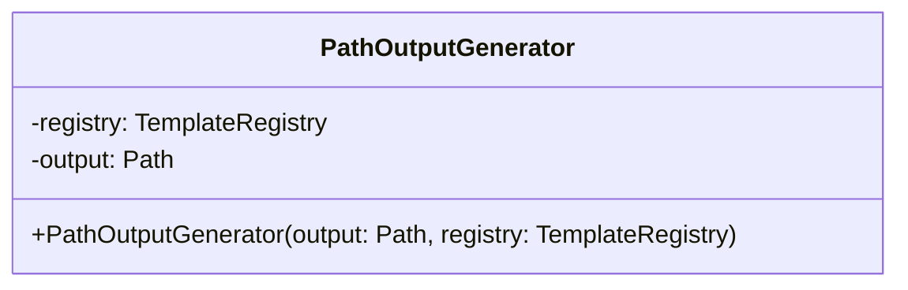
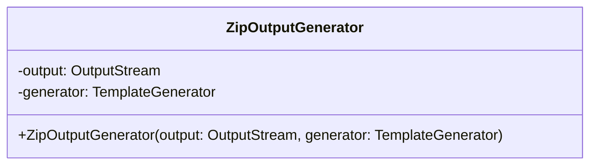
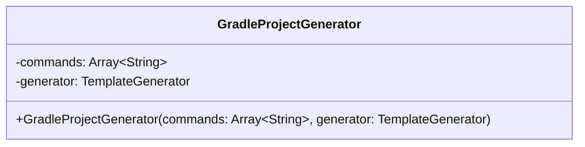

Kotli engine is a Kotlin library designed to generate project structures based on blueprint templates of any complexity.

It provides a simplified framework to describe a template as a set of functional blocks. Prepared templates are self-sufficient, containing all the metadata necessary for presentation and facilitating the multi-step process of generating an output structure.

 ```
 The cool part about this library is that you can just snag any project with any structure and roll with it as your input template.
 It's all about that 'take what you need, toss what you don't' vibe.
 No need to waste time learning some new syntax—just whip up a regular project structure and make it layer-able.
 ```

The online service [Kotli](https://kotlitecture.com) utilizes this framework and the templates based on it as part of its project builder interface.

# Getting Started

// TODO

# Technical Concept

The template generation process involves creating output structures based on a specified layer and associated features.
This process is orchestrated by the TemplateGenerator class, which is responsible for producing templates to an output stream.
The entire operation is driven by the Layer data model, representing the metadata of a specific layer with configured features and attributes.



- **Layer** - Represents the metadata of a specific layer.
- **TemplateGenerator** - Responsible for generating templates. It contains the logic for generating the required output structure based on the specified layer.
- **Output Structure** - The resulting template streamed to the chosen output destination (File, Zip, Database, etc.).

## Layer

A layer represents a distinct aspect of your project, such as Frontend, Backend, Testing, etc.
In Kotli, even the top-level project is considered to be a layer.
This is because, in general, and in the future, it can be part of a more complex system.

 ```mermaid
 classDiagram
   direction LR
   class Layer {
      +id: String
      +name: String
      +namespace: String
      +generatorId: String
      +description: String?
      +layers: List~Layer~
      +features: List~Feature~
   }

   class Feature {
      +id: String
      +attributes: Map~String, String~
   }

   Layer --|> Feature : contains
 ```

Layer attributes:
- **id** - a unique identifier to distinct this layer from others.
- **name** - represents the root folder of the generated layer.
- **namespace** - the package name, bundle id, or application id, depending on the context.
- **generatorId** - the id of the generator used to resolve in the template registry.
- **description** - a brief description of the layer.
- **layers** - child layers, if applicable.
- **features** - features to be included in the layer.

Feature attributes:
- **id** - a feature identifier used to find a processor responsible for including or excluding this feature.
- **attributes** - input attributes to be used by the processor to customize the feature.

## Template Generator



The high level relationships:
1. TemplateGenerator: Responsible for template generation. It is associated with:
    - Creation of a TemplateContext.
    - Processing using a TemplateProcessor.
2. TemplateProcessor: Responsible for processing templates. It has relationships with:
    - Retrieving feature providers through getProcessors from a FeatureProvider.
    - Applying or removing features through a FeatureProcessor.
3. FeatureProcessor: Responsible for including or excluding features in the generated template.
4. FeatureProvider: Represents a registry of feature processors. It has relationships with:
   - Providing feature processors to a TemplateProcessor.
5. TemplateContext: Represents the execution context for a template. It is associated with:
   - Applying and removing features through a FeatureProcessor.
   - Using a Layer in its operations.
6. Layer: Represents a layer information used in template generation.

In general, the whole template generation flow looks like this:



The Engine provides out-of-the-box implementations of generators for various output streams and purposes.

### PathOutputGenerator

This is the most common implementation, generating the output structure in the provided output folder.
By default, the target folder is set as the root directory in an in-memory file structure implementation.
It utilizes the provided TemplateRegistry to access template processors.



### ZipOutputGenerator

This implementation consumes the output structure from the underlying generator and saves it as a zip archive into the provided output stream.



### GradleProjectGenerator

This implementation consumes the output structure and proceeds with the execution of command-line commands,
treating the generated structure as a Gradle project. It executes a given set of commands as arguments for the gradlew command.
The generation process will only be considered complete after the successful execution of the provided Gradle commands.


