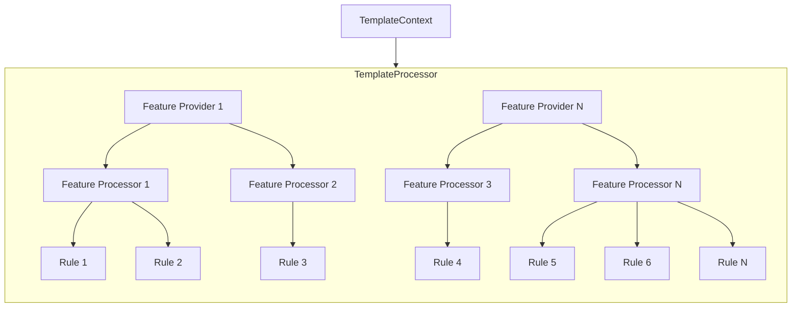

Kotli engine is a Kotlin library designed to generate project structures based on blueprint templates of any complexity.

It provides a simplified framework to describe a template as a set of functional blocks.
Prepared templates are self-sufficient, containing all the metadata necessary for presentation and facilitating the multi-step process of generating an output structure.

The online service [Kotli](https://kotlitecture.com) utilizes this framework and the templates based on it as part of its project builder interface.

All documentation about **Kotli** can be found [here](https://kotlitecture.github.io).

# Fundamental Concept

The library centers around the flexibility to seamlessly integrate any project as an input template, irrespective of its structure.
The key philosophy is to adopt a `take what you need, discard what you don't` approach.
This approach lets to:
- Focus on the solution architecture of the template without worrying about the syntax of the engine or its limitations.
- Assess how new functionality impacts the entire project when it is built in 'fat' mode.
- Keep the engine simple and not tied to any structure.

# Getting Started

// TODO

```kotlin
    val androidProcessor = AndroidComposeTemplateGenerator() // some android app template processor
    val backendProcessor = SpringBootTemplateGenerator() // some backend template processor
    val templateRegistry = DefaultTemplateRegistry(
        androidProcessor,
        backendProcessor
    )
    val templateGenerator = PathOutputGenerator(registry = templateRegistry)
    val androidAppLayer = Layer(
        processorId = androidProcessor.getId(),
        name = "my-android-app",
        namespace = "my.app",
        features = listOf() // add some features
    )
    templateGenerator.generate(androidAppLayer)
```

# Technical Guide

The template generation process involves creating output structures based on a specified layer and associated features.
This process is orchestrated by the `TemplateGenerator` class, which is responsible for producing templates to an output stream.
The entire operation is driven by the `Layer` data model, representing the metadata of a specific layer with configured features and attributes.


- **Layer** - Represents the metadata of a specific layer.
- **TemplateProcessor** - Prepares the template structure from the passed metadata.
- **TemplateGenerator** - Generates the template to the specified output stream.
- **Output Structure** - The resulting template streamed to the chosen output destination (File, Zip, Database, etc.).

## Layer

A layer represents a distinct aspect of your project, such as Frontend, Backend, Testing, etc.
In Kotli, even the top-level project is considered to be a layer.
This is because, in general, and in the future, it can be part of a more complex system.

 ```mermaid
 classDiagram
   direction LR
   class Layer {
      +id: String
      +name: String
      +namespace: String
      +processorId: String
      +description: String?
      +layers: List<Layer>
      +features: List<Feature>
   }

   class Feature {
      +id: String
      +attributes: Map<String, String>
   }

   Layer --|> Feature : contains
 ```

Layer attributes:
- **id** - a unique identifier to distinct this layer from others.
- **name** - represents the root folder of the generated layer.
- **namespace** - the package name, bundle id, or application id, depending on the context.
- **processorId** - the id of the processor used to resolve in the template registry.
- **description** - a brief description of the layer.
- **layers** - child layers, if applicable.
- **features** - features to be included in the layer.

Feature attributes:
- **id** - a feature identifier used to find a processor responsible for including or excluding this feature.
- **attributes** - input attributes to be used by the processor to customize the feature.

## TemplateProcessor

This class is responsible for transforming an input `Layer` into a set of rules not bound to any specific output structure.
The created set of rules is utilized by `TemplateGenerator` to construct an output structure from the given template, including only the required functionality.
Each template is associated with its own `TemplateProcessor`, and each `TemplateProcessor` **operates** exclusively with a **single template**.



The high level relationships:
1. **TemplateContext**: Represents the execution context for a template.
   It retains the passed `Layer` object and accumulates a set of rules to manipulate the initial template structure.
2. **TemplateProcessor**: Responsible for processing template.
3. **FeatureProvider**: Represents a registry of feature processors with common behavior.
4. **FeatureProcessor**: Responsible for creating rules in `TemplateContext` to apply or remove a given feature in the generated structure.
5. **Rule**: Responsible for modifying some specific file in the template.

### Rule

It is an essential part of every template processor. Each rule is responsible for making specific changes to a particular file in the template.
However, it is not tied to any file it modifies. The engine implements some common rules for file manipulation,
and it is possible to create new ones with any logic to operate with template generation more powerfully.


## TemplateGenerator

The template generator is utilized to generate the necessary output structure, such as a File, Zip, Database, etc.
It depends on both the `Layer` and `FeatureProcessor`.
Usually, there's no need to create other implementations of this class.
However, the solution is designed to be flexible, allowing the creation of any other type of output structure if necessary.


The high level relationships:
1. **Layer**: Represents layer information used in template generation.
2. **TemplateRegistry**: Provides `TemplateGenerator` with all required template processors.
3. **TemplateGenerator**: Responsible for producing an output stream from passed metadata. It is associated with:
    - Creation of a `TemplateContext` from the passed `Layer`.
    - Processing metadata using set of required `TemplateProcessor`.
4. **TemplateContext**: Represents the execution context for a template.
5. **TemplateProcessor**: Responsible for processing templates.

In general, the whole template generation flow looks like this:


The Engine provides out-of-the-box implementations of generators for various output streams and purposes.

### PathOutputGenerator

This is the most common implementation, generating the output structure in the provided output folder.
By default, the target folder is set as the root directory in an in-memory file structure implementation.
It utilizes the provided TemplateRegistry to access template processors.


### ZipOutputGenerator

This implementation consumes the output structure from the underlying generator and saves it as a zip archive into the provided output stream.


### GradleProjectGenerator

This implementation consumes the output structure and proceeds with the execution of command-line commands,
treating the generated structure as a Gradle project. It executes a given set of commands as arguments for the gradlew command.
The generation process will only be considered complete after the successful execution of the provided Gradle commands.

Keep in mind that the provided generator should produce a file structure on physical storage,
ensuring that commands can be executed properly.


# Contribution Guide

Not ready yet:(
However fill free to ping me on Discord in case you have something.
